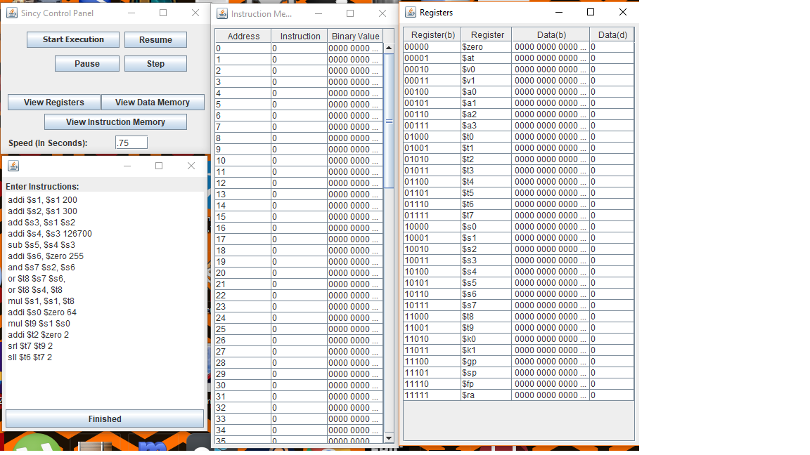

.. Sincy Single Cycle MIPS Simulator documentation master file, created by
   sphinx-quickstart on Mon Mar 18 22:55:29 2019.
   You can adapt this file completely to your liking, but it should at least
   contain the root `toctree` directive.

Welcome to Sincy Single Cycle MIPS Simulator's website!
=============================================================

About Sincy
*****************
Thank you for considering the download and use of the Sincy Single Cycle MIPS Simulator! We worked very hard to bring you this program and hope that it supplements your understanding of the MIPS process lifecycle. This program is intended for students who are taking or are interested in taking a computer architecture course. In order to use the software, one must be familiar with basic assembly language syntax and its use. The only thing you need to begin to use this software is a computer capable of running a simple Java Applet. The program is fairly basic and about 1.5MB and should run on virtually any machine made in the last 30 years.

Download
**************
`Download Sincy <https://patrickmartinez.us/sincy.jar>`_

How to use
*************
A user guide has been prepared for this project and can be downloaded here.
`Download User Manual <https://s3.us-east-2.amazonaws.com/patrickmartinez.us/Sincy+Technical+Manual.pdf>`_

Open Source License
***********
Released on an open source license. Do whatever you want with this software. Documentation to assist developers can be found here.
`Documentation <https://patrickmartinez.us/doc>`_

